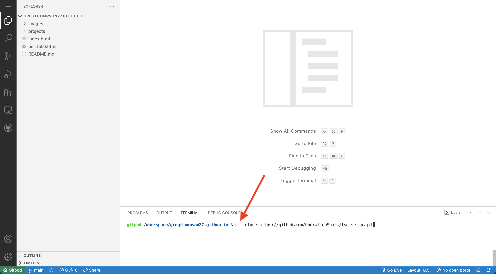
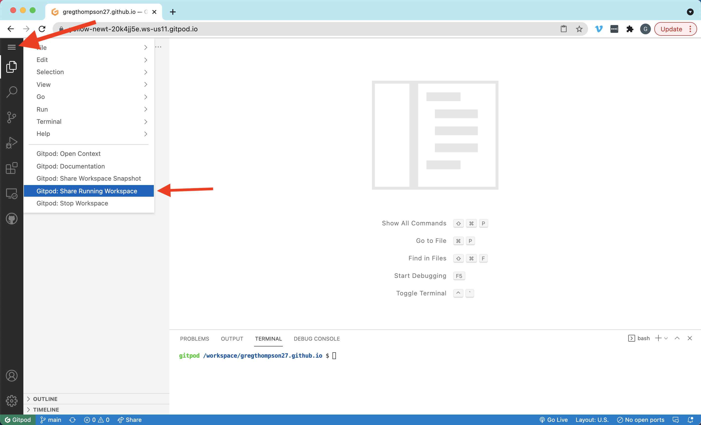

# Set up your Github / Gitpod Workspace

Below, you will find instructions for creating a github repository and setting up your Gitpod workspace. Read all instructions carefully before moving on. If you get stuck, encounter an issue, or simply need help, reach out to your instructor immediately.

## 0) Pre-requisites:

Before continuing on to the next steps, make sure that you have done the following:
* Created a personal email account on Gmail.
* Created an account on Greenlight
* Created an account on Github
* Joined the Operation Spark Github Team. You can find your invitation to join this team by going to github.com/OperationSpark.

## 1) Create a GitHub repository 

Click here to open a new browser tab and create create a new GitHub repository:
<a href="https://github.com/new" target="_blank">Right Click --> Open Link In New Tab </a>.

### NOTE: If you're not signed-in to GitHub, you might see a web page that says 404 (This is not the web page you are looking for).  Just sign-in to GitHub on this page and you will be forwarded to the _create new repository_ page.

Follow these steps and see the screenshot below to create a new repository.

**Click to enlarge image**

1. On the Create New Repository page, in the box for **Repository name**, name the repository like:

    `your-github-username.github.io`
    
    replacing `your-github-username` with your actual GitHub username.  MAKE SURE your username is spelled correctly, otherwise you'll have problems.
    

2. Enter a description for your repository in the **Description** box, like `My own awesome website!'.

3. Select the **Public** radio button to allow anyone to see this repository.

4. Check the **Initialize this repository with a README** box.
    
5. Double check that you have followed these instructions properly. Then click **Create Repository** **(See F)**.

Awesome, you created your repository!

## 2) Create a Gitpod Workspace

Click the green "Code" button on your repository on Github and copy the displayed URL using the clipboard

1. In your internet browser, type the prefix **gitpod.io/#** followed immediately by the code to your respository URL (The URL you create should look similar to the screenshot above, the only difference being you are using your unique link to your repository)
2. Click enter

3. On the next screen (shown above), click on 'Continue with Github'. You will sign in using your Github credentials on the next screen

## 3) Allow GitHub Access

Go to: <a href=https://gitpod.io/integrations>gitpod.io/integrations</a> and edit permissions for Github (see image below).

Check all of the boxes and update your permissions.

## 4) Install your projects

With your workspace open, find bash terminal and enter these commands one at a time (see above)
* `git clone https://github.com/OperationSpark/fsd-setup.git`
* `npm install -g opspark`
* `chmod +x fsd-setup/setup.sh`
* `./fsd-setup/setup.sh`
* `rm -rf ./fsd-setup`

Enter your username and your password.

## 5) Pin Your workspace

1. Go to <a href=https://gitpod.io/workspaces>https://gitpod.io/workspaces</a>
2. Click on the Pin icon next to your workspace (see red arrows below). If your workspace is not showing, click the filter button and select all (see the blue arrow below) and then pin your workspace.

# Other useful features of Gitpod

## To Preview Your Code

1. Install Live Server (see above)
2. Right Click on `index.html` of the project you are working on and select "Preview with Live Server"

## To Share your Code

Workspace --> Share Running Workspace

## Set up Auto Save

File --> Auto Save

## To Push Code

Return to your workspace and find the bash terminal.

Then, enter these commands

`git add .`

`git commit -m "describe your changes here"`

`git push`
