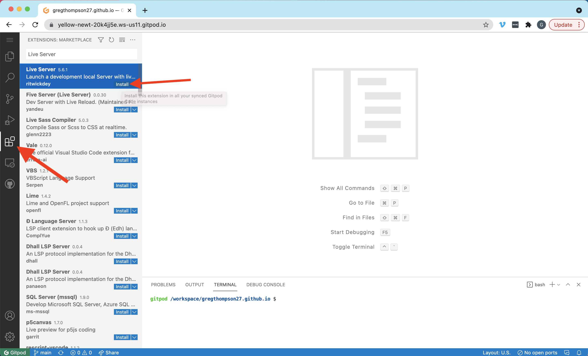

# Set up your Github / Gitpod Workspace

Below, you will find instructions for creating a github repository and setting up your Gitpod workspace. Read all instructions carefully before moving on. If you get stuck, encounter an issue, or simply need help, reach out to your instructor immediately.

**Table of Contents**

- [Step 0 - Prerequisites](#0-pre-requisites)
- [Step 1 - Create a GitHub Repository](#1-create-a-github-repository)
- [Step 2 - Login to Gitpod using your GitHub Account](#2-login-to-gitpod-using-your-github-account)
- [Step 3 - Create your Gitpod Workspace](#3-create-your-gitpod-workspace)
- [Step 4 - Install Your Projects](#4-install-your-projects)
- [Step 5 - Pin Your Workspace](#5-pin-your-workspace)

---

## 0) Pre-requisites:

Before continuing on to the next steps, make sure that you have done the following:

- Created a personal email account on Gmail.
- Created an account on Greenlight
- Created an account on Github
- Joined the Operation Spark Github Team. You can find your invitation to join this team by going to github.com/OperationSpark.

## 1) Create a GitHub repository

Click here to open a new browser tab and create create a new GitHub repository:
<a href="https://github.com/new" target="_blank">Right Click --> Open Link In New Tab </a>.

### NOTE: If you're not signed-in to GitHub, you might see a web page that says 404 (This is not the web page you are looking for). Just sign-in to GitHub on this page and you will be forwarded to the _create new repository_ page.

1. On the Create New Repository page, in the box for **Repository name**, name the repository like:

   `your-github-username.github.io`

   replacing `your-github-username` with your actual GitHub username. MAKE SURE your username is spelled correctly, otherwise you'll have problems.

2. Enter a description for your repository in the **Description** box, like `My own awesome website!'.

3. Select the **Public** radio button to allow anyone to see this repository.

4. Check the **Add a README file** box.
5. Double check that you have followed these instructions properly. **_Your screen should match up with the image below._** Then click the green **Create Repository**.

**Click to enlarge image**

Awesome, you created your repository!

## 2) Login to Gitpod using your GitHub account

Go to: <a href="https://gitpod.io/login/" target="_blank">gitpod.io/login</a> and select "Continue with GitHub"

Authorize GitHub in the popup that appears

Go to: <a href="https://gitpod.io/integrations" target="_blank">gitpod.io/integrations</a> and edit permissions for Github (see image below).

Check all of the boxes and update your permissions.

## 3) Create your Gitpod Workspace

Go to: <a href="https://gitpod.io/workspaces" target="_blank">gitpod.io/workspaces</a> and click the "New Workspace" button

Choose the repository that includes your github username

Now Gitpod will take a minute or so to create a workspace for you!

## 4) Install your projects

When your workspace loads up it should include a terminal at the bottom of the screen.

With your workspace open, copy the following commands one at a time and paste them into your terminal. After pasting each command, press the "Enter" key on your keyboard to run the command.

- `git clone https://github.com/OperationSpark/fsd-setup.git`
- `npm install -g opspark`
- `chmod +x fsd-setup/setup.sh`
- `./fsd-setup/setup.sh`
- `rm -rf ./fsd-setup`

## 5) Pin Your workspace

1. Go to <a href=https://gitpod.io/workspaces target="_blank">https://gitpod.io/workspaces</a>
2. Click on the Pin icon next to your workspace (see red arrows below). If your workspace is not showing, click the filter button and select all (see the blue arrow below) and then pin your workspace.

### NOTE: This step is CRITICAL to make sure that your workspace does not automatically delete after a period of activity. Deleted workspaces are not able to be recovered, so pinning it makes sure your workspace will still be there everytime you login.

# Other useful features of Gitpod

## To Preview Your Code

1. Install the `Live Server` extension (see above). The extension you should install is the one authored by **_ritwickdey_**.
2. Right Click on the `index.html` file of the project you are working on and select "Preview with Live Server"

## To Share your Code

Make sure that your workspace has 'Share'checked off to enable sharing mode.

Then, copy your workspace's URL (highlighted below) to share. You must actively have your workspace open in order for the link shared to be accessed by someone else.

## To Push Code

Return to your workspace and find the bash terminal.

Then, enter these commands

`git add .`

`git commit -m "install projects"`

`git push`
